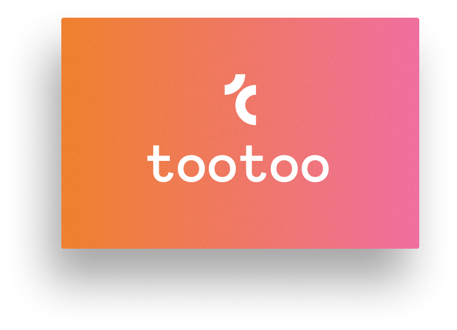
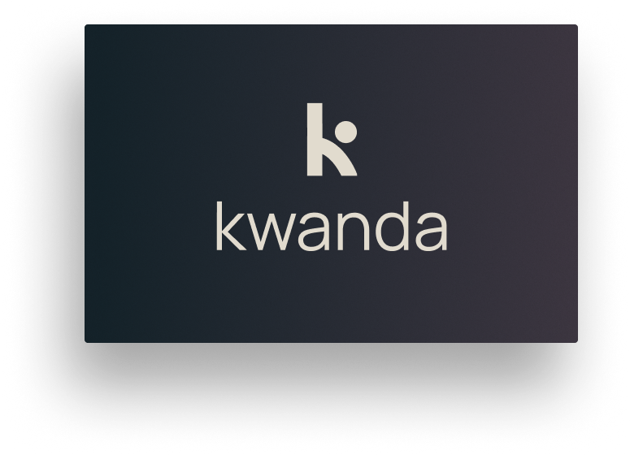

  

&nbsp;&nbsp;&nbsp;&nbsp;&nbsp;&nbsp;&nbsp;&nbsp;&nbsp;

**A South African venture studio shaping human-centred AI.**
 
We build the products, agents, and infrastructure that give AI real memory, real context, and real roots.

 
 

---

## What we're building

Ubundi is a venture studio. We build and spin out products that make AI more useful,
more trustworthy, and more grounded in the people it serves.

<table>
  <tr>
    <td width="50%" valign="top">
      
      <h3 align="center">tootoo</h3>
      
<em>A live identity layer that any LLM can read.</em>

      
tootoo turns self-knowledge into personal context — what you value, believe, and aspire to — so the answers you get are actually grounded in you.

      
<a href="https://github.com/Ubundi/tootoo-openclaw">→ tootoo for OpenClaw</a>

    </td>
    <td width="50%" valign="top">
      
      <h3 align="center">kwanda</h3>
      
<em>From AI idea to AI initiative.</em>

      
kwanda scopes and implements your AI initiatives — custom agents, automation, and training that future-proof your business with AI.

      
<a href="https://ubundi.com">→ Learn more</a>

    </td>
  </tr>
</table>

## Open source

Our public work spans agent memory, evaluation, and the developer tooling around it.

**Memory &amp; agents**
- **[openclaw-cortex](https://github.com/Ubundi/openclaw-cortex)** — Long-term memory for OpenClaw agents. Automatic recall before every turn, automatic capture after, and background file sync, backed by knowledge-graph retrieval.
- **[engram-benchmark](https://github.com/Ubundi/engram-benchmark)** — A benchmark for evaluating long-term memory in AI agents: seed conversations, let memory process, then probe recall in a fresh session.

**Integrations &amp; tooling**
- **[tootoo-openclaw](https://github.com/Ubundi/tootoo-openclaw)** — tootoo for OpenClaw.
- **[ubundi-agent-mode](https://github.com/Ubundi/ubundi-agent-mode)** — Guide and templates for making Ubundi artifacts context-readable for agents.

**Ventures**
- **[firstmotive-site](https://github.com/Ubundi/firstmotive-site)** — First Motive: ground-truth infrastructure for Physical AI.

[**Explore all public repositories →**](https://github.com/orgs/Ubundi/repositories)

---

## Why Ubundi

*AI will soon be woven into every part of society.*
*The question is no longer whether it will shape our future,*
*but **who** will shape it, and **for whom**.*

&nbsp;

We bring together experience from leading technology companies with deep roots in
South Africa. We're builders, researchers, and community organizers united by a vision:
to ensure AI's transformative power benefits our continent first.

If you're a high-conviction founder or engineer, we'd love to hear from you.

&nbsp;

**[ubundi.com](https://ubundi.com)**

